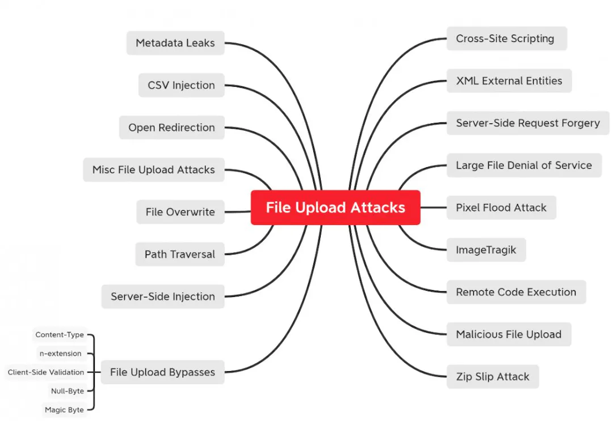

# File upload vulnerability report

### Location:  ***http://192.168.56.3/index.php?page=upload***

## Description:

The below mindmap from [**YesWeHack**](https://www.yeswehack.com/learn-bug-bounty/file-upload-attacks-part-2) gives an idea of various attacks of file uploading.




We initially tried _uploading a PHP script directly_, but this was unsuccessful due to the application's file type validation mechanism.

Next, we attempted _to embed a PHP script within a corrupted image file_. The file was successfully uploaded in **/tmp/** directory but we were not able to access to this folder.

Upon closer inspection, we discovered that the application uses the [**Content-Type: multipart/form-data**](https://developer.mozilla.org/en-US/docs/Web/HTTP/Headers/Content-Type) for file uploads.

```
POST /index.php?page=upload HTTP/1.1
Host: 192.168.56.3
User-Agent: Mozilla/5.0 (X11; Ubuntu; Linux x86_64; rv:109.0) Gecko/20100101 Firefox/115.0
Accept: text/html,application/xhtml+xml,application/xml;q=0.9,image/avif,image/webp,*/*;q=0.8
Accept-Language: en-US,en;q=0.5
Accept-Encoding: gzip, deflate
Content-Type: multipart/form-data; boundary=---------------------------345929136431312008043203062130
Content-Length: 2248
Origin: http://192.168.56.3
Connection: keep-alive
Referer: http://192.168.56.3/index.php?page=upload
Cookie: I_am_admin=68934a3e9455fa72420237eb05902327
Upgrade-Insecure-Requests: 1
```

We developed a _custom/fake_ form-data to match the structure of the legitimate form submission. This included recreating the boundary string and accurately formatting the file upload part of the request.

## Recommendations:

1. Impliment input _validation_ and _sanitization_.

2. Create a _whitelist_ of allowed file types/extensions.

3. _Store_ uploaded files _outside_ the web root directory.